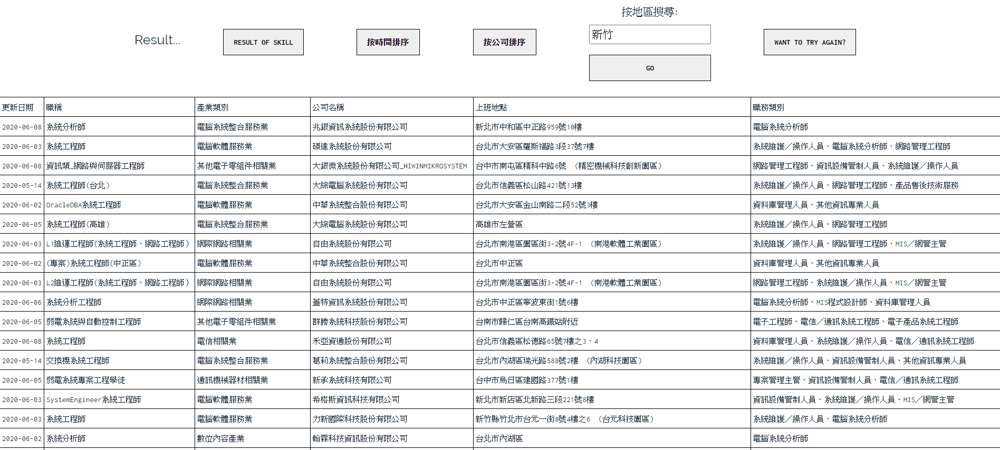
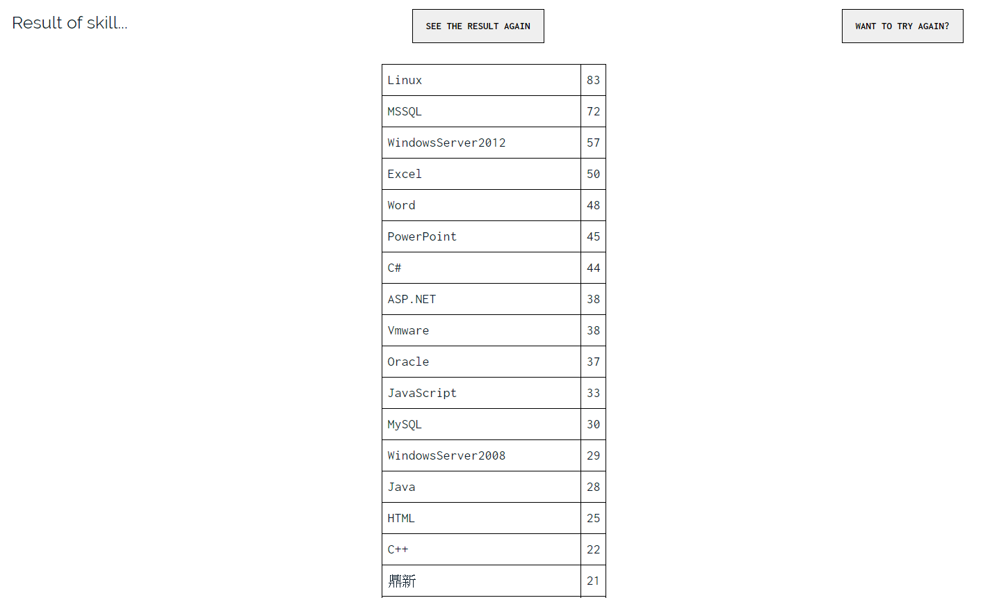
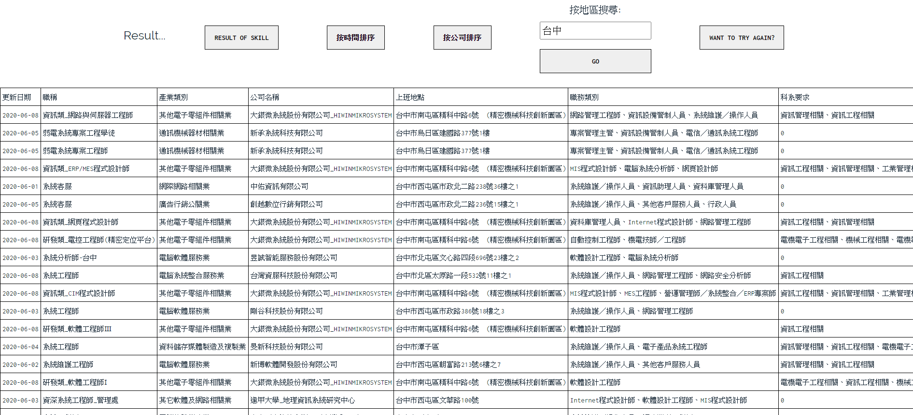

# 104 crawler web
- [x] Flask
- [x] jinja2
- [x] pandas

# Step 1:
```shell
cd a104
python hw_104_jinja2.py
```
- Check `localhost:5000`

# Step 2:
- input `keyword`  

# Step 3:
- `crawling`  

# Step 4:
- The `result` includes `Refresh time`, `Job name`, `Industry category`, `Location`, `Skill requirements`...  

- also you can count how mucht `skill` in this list  

- sorted by `location`  
